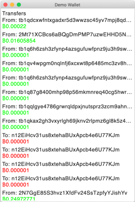
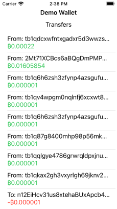

# WalletKit Kotlin


Multiplatform [WalletKit](https://github.com/blockset-corp/walletkit) Kotlin SDK implementation, providing cryptocurrency wallet features for various blockchains.

[API Documentation](https://drewcarlson.github.com/WalletKit-Kotlin)

## About

WalletKit-Kotlin provides a single interface for managing many currencies.
Data is provided by [Blockset](https://blockset.com/) when using API modes, in P2P modes data is accessed directly from the blockchain.
[Ktor](https://ktor.io/) and [Blockset-Kotlin](https://github.com/DrewCarlson/Blockset-Kotlin/) are used for multiplatform networking capabilities.

WalletKitCore is built automatically when compiling any of the Kotlin targets or demos, assuming the host supports the target platform.

## Demo

The [demo-wallet](demo-wallet) modules provides a demo exercising various wallet features on multiple platforms.

[](#demo)
[](#demo)

### Jvm

The Jvm desktop client uses [Jetbrains Compose](https://www.jetbrains.com/lp/compose/).
Run with `./gradlew :demo-wallet:run`

### iOS

The iOS client uses Swift UI.
Open the [ios-demo](demo-wallet/ios-demo) xcode project and click Run.

The `demo-wallet` gradle module produces `DemoWalletKotlin.framework` for use in the xcode project.
The xcode project build process builds the kotlin framework automatically.


## Usage

A free Blockset token is required to use this library or run tests/demos, [learn more](https://docs.blockset.com/getting-started/authentication).
For demo/tests: add the token to your environment with `export BDB_CLIENT_TOKEN="..."` before running any gradle commands.

Here is a minimal example of System creation in platform-independent Kotlin.
```kotlin
val phraseBytes = "marine ...".encodeToByteArray()
val bdbToken = "..." // Blockset client or user JSON Web Token (JWT) 

val listener = object : SystemListener {
    // handleManagerEvent, handleNetworkEvent, handleTransferEvent, handleWalletEvent
    override fun handleSystemEvent(system: System, event: SystemEvent) {
        println("System Event: $event")
    }
}

val uids = "<UUID>"
val timestamp = 0 // Account creation timestamp in seconds
val account = Account.createFromPhrase(phraseBytes, timestamp, uids)

val isMainnet = false
val storagePath = "/path/to/data"

val system = System.create(
    listener,
    checkNotNull(account),
    isMainnet,
    storagePath,
    BdbService.createForTest(bdbToken)
)

system.configure(emptyList())
```

In Swift the code looks the same, considering a few [Kotlin/Swift Interoperability](https://kotlinlang.org/docs/reference/native/objc_interop.html) details.

```swift
class Listener : DefaultSystemListener {
    override func handleSystemEvent(system: System, event: SystemEvent) {
        print("System Event: \(event)")
    }
}

let bdbAuthToken = "..."
let uids = UUID.init().uuidString
let phrase = "house ...".data(using: .utf8)!
let account = Account.Companion.init().createFromPhrase(phrase: phrase, timestamp: 0, uids_: uids)!
let bdbService = BdbServiceCompanion.init().createForTest(bdbAuthToken: bdbAuthToken)

let system = System.Companion.init().create(
    listener: Listener(),
    account: account,
    isMainnet: false,
    storagePath: "...",
    query: bdbService
)

system.configure(appCurrencies: [])
```

## Download


Artifacts are available on [Bintray](https://bintray.com/drewcarlson/WalletKit-Kotlin).

```kotlin
repositories {
  jcenter()
  // Or snapshots
  maven { setUrl("http://oss.jfrog.org/artifactory/oss-snapshot-local") }
}

dependencies {
  implementation("drewcarlson.walletkit:walletkit:$WALLETKIT_VERSION")
}
```

## License
```
Copyright (c) 2020 Andrew Carlson

Permission is hereby granted, free of charge, to any person obtaining a copy
of this software and associated documentation files (the "Software"), to deal
in the Software without restriction, including without limitation the rights
to use, copy, modify, merge, publish, distribute, sublicense, and/or sell
copies of the Software, and to permit persons to whom the Software is
furnished to do so, subject to the following conditions:

The above copyright notice and this permission notice shall be included in all
copies or substantial portions of the Software.

THE SOFTWARE IS PROVIDED "AS IS", WITHOUT WARRANTY OF ANY KIND, EXPRESS OR
IMPLIED, INCLUDING BUT NOT LIMITED TO THE WARRANTIES OF MERCHANTABILITY,
FITNESS FOR A PARTICULAR PURPOSE AND NONINFRINGEMENT. IN NO EVENT SHALL THE
AUTHORS OR COPYRIGHT HOLDERS BE LIABLE FOR ANY CLAIM, DAMAGES OR OTHER
LIABILITY, WHETHER IN AN ACTION OF CONTRACT, TORT OR OTHERWISE, ARISING FROM,
OUT OF OR IN CONNECTION WITH THE SOFTWARE OR THE USE OR OTHER DEALINGS IN THE
SOFTWARE.
```
